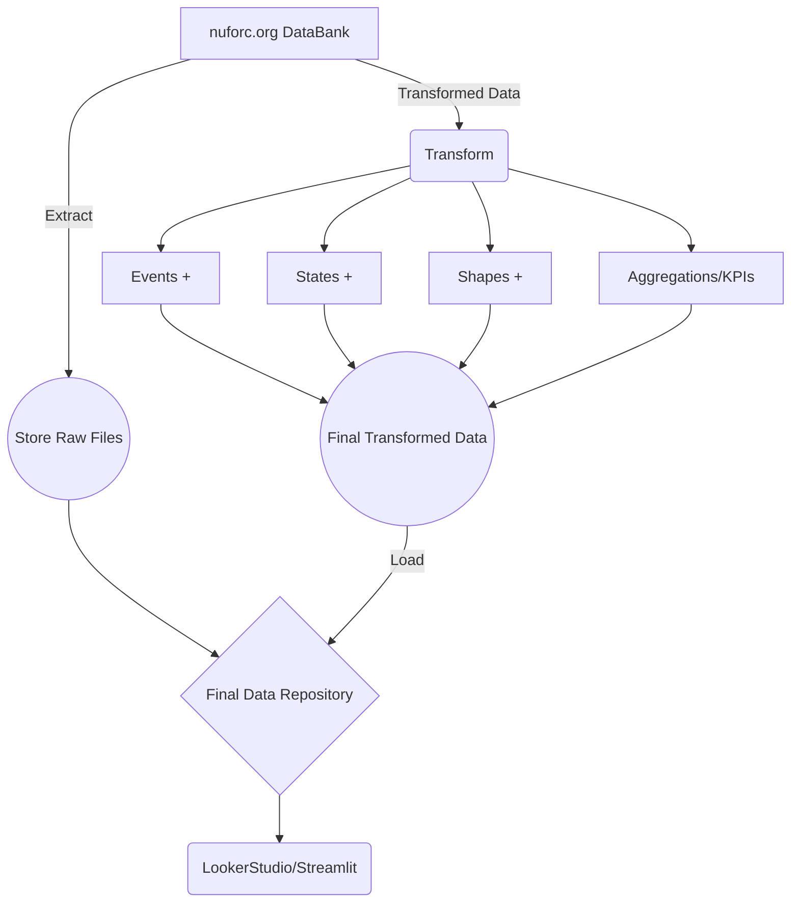

# UFO_Sightings

The [NATIONAL UFO Reporting Center](https://nuforc.org/databank/) maintains an Online repository of all the UFO sightings which is currently limited to state of USA.
There are four types of indexed datasets available :  
[Index by EVENT DATE](https://nuforc.org/webreports/ndxevent.html)  
[Index by STATE](https://nuforc.org/webreports/ndxloc.html)  
[Index by SHAPE OF UFO](https://nuforc.org/webreports/ndxshape.html)  
[Index by DATE POSTED](https://nuforc.org/webreports/ndxpost.html)

This is a Hobby Project to get that data and visualize how it looks like :)

# Files & Folders

-  **ndxevent.py** : gets all events data

-  **ndxloc.py** : gets all location based data

-  **ndxshape.py** : data related to shape of the UFO

-  **scheduler.py** : Monthly/Weekly checker, that checks for updates on nuforc and updates `airflow-wip`
- datacheck.py : data sanity checker / logger  `wip`

-  **/data** : folder which has the initial version of the gathered data

# Plan & Execution

>I did not want to use the libraries like BeautifulSoup/lxml that makes my life simpler,I just want to write as many lines of raw code as possible to make this work.

